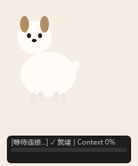

# 🐶 千千桌宠

> 一只漂浮在 Windows 桌面右下角的像素小狗，作为 Claude Code 的桌面伴侣。



---

## ✨ 功能特性

### 桌面伙伴
- 11 种像素帧动画状态：待机、四向行走、睡觉、玩耍、思考、说话、开心、吃东西
- 透明悬浮窗，可拖拽移动，总在最前
- 空闲 5 分钟自动蜷缩睡觉，交互自动唤醒
- 双击玩耍翻滚，拖拽跟随走动

### Claude Code 聊天
- 单击千千弹出聊天窗口，直接与 Claude Code 对话
- 支持 Markdown 渲染：标题、粗体、代码块、表格、列表、引用
- Ctrl+Shift+W 快捷唤起聊天窗
- 聊天记录自动保存到 `chat_history.md`

### 语音输出
- Edge TTS 朗读 Claude 回复（萌音：pitch+15%, rate-10%）
- 说话时千千播放松嘴动画

### 文件分析
- 从资源管理器拖文件到千千 → 自动发给 Claude 分析

### 系统集成
- 托盘图标 + 右键菜单（切换会话、暂停动画、设置、退出）
- 设置面板：修改名字、唤醒词、空闲睡眠时间、语音开关
- 窗口位置自动保存，重启恢复

---

## 📦 安装

### 方式一：安装向导（推荐）

1. 下载 `publish/Setup/` 文件夹（或下载 Release 中的 `千千安装包.zip`）
2. 解压后双击 **`千千安装向导.exe`**
3. 按 7 步向导完成：

| 步骤 | 说明 |
|------|------|
| 欢迎 | — |
| 环境检测 | 自动检测 .NET 8 Runtime 和 Node.js，缺少则自动下载安装 |
| 取名 | 给你的小狗狗取名字，默认"千千" |
| Claude 安装 | 检测 Claude Code CLI，已安装则跳过，未安装自动执行 npm install |
| 模型配置 | 选择供应商（Anthropic/OpenAI/智谱/自定义）、输入 API Key、模型名称 |
| 安装 | 释放文件到 `%LOCALAPPDATA%\千千桌宠\` |
| 完成 | 创建桌面快捷方式，点击启动 |

### 方式二：源码运行

```bash
# 前提条件
# - .NET 8 SDK
# - Claude Code CLI

git clone git@github.com:Y-zhi-vacuous/claude-pet.git
cd claude-pet
dotnet run --project src/ClaudePet
```

---

## 🔧 构建安装包

```bash
powershell -File build-installer.ps1
# 输出: publish/Setup/千千安装向导.exe
```

---

## 🏗️ 技术栈

| 技术 | 用途 |
|------|------|
| .NET 8 + WPF + C# 12 | 桌面应用框架 |
| Claude Code CLI | AI 对话引擎 (`claude -p`) |
| Edge TTS | 语音朗读（zh-CN-XiaoxiaoNeural） |
| NAudio | 音频播放 |
| Newtonsoft.Json | JSON 配置读写 |
| System.Speech | 语音识别（已弃用，保留接口） |

---

## 📁 项目结构

```
claude-pet/
├── README.md
├── config.json                    # 配置文件
├── claude-pet.sln                 # 解决方案
├── build-installer.ps1            # 安装包构建脚本
├── SPRITE_SPEC.md                 # 精灵帧规格（给视觉模型生成精灵用）
├── assets/sprites/                # 11 状态 × 50 帧像素精灵 PNG
├── Image/                         # 千千原图
├── src/
│   ├── ClaudePet/                  # 千千主程序
│   │   ├── Animation/             # SpriteSheetPlayer 帧动画播放器
│   │   ├── Bridge/                # ClaudeBridge + ProcessManager + TranscriptWatcher
│   │   ├── Models/                # AnimationState / PetConfig / StateSnapshot
│   │   ├── UI/                    # PetWindow / BubbleOverlay / SettingsWindow / TrayManager
│   │   ├── Utils/                 # ConfigStore / MouseDragHelper / ChatLogger
│   │   └── Voice/                 # VoiceEngine / EdgeTTSEngine / KeyboardWakeDetector
│   └── Setup/                     # 安装向导（独立 WPF 项目）
├── docs/
│   ├── design/                    # 初始设计文档
│   ├── plans/                     # 分阶段实现计划
│   ├── superpowers/specs/         # 设计规格（记忆系统/安装包）
│   └── development-summary.md     # 开发总结
└── publish/Setup/                 # 可分发安装包
    └── 千千安装向导.exe
```

---

## ⌨️ 快捷键

| 快捷键 | 功能 |
|--------|------|
| `Ctrl+Shift+W` | 唤醒千千，弹出聊天窗 |
| 单击千千 | 切换聊天窗显示/隐藏 |
| 双击千千 | 玩耍翻滚动画 |
| 拖拽千千 | 移动位置 |
| 拖文件到千千 | 发给 Claude 分析 |

---

## ❓ 常见问题

**Q: 聊天发消息没反应？**
A: 确认已安装 Claude Code CLI。命令行执行 `claude --version` 验证。

**Q: 语音识别不能用？**
A: 语音识别已移除。语音输出（TTS）正常——千千会用萌音朗读回复。

**Q: 怎么切换模型？**
A: 安装向导第 5 步可以配置。已安装的用户可以手动编辑 `~/.claude/settings.json`。

**Q: 精灵帧不好看？**
A: 参考 `SPRITE_SPEC.md` 规格文档，用视觉模型生成新的精灵帧替换 `assets/sprites/` 下的 PNG。

---

## 📄 License

MIT
